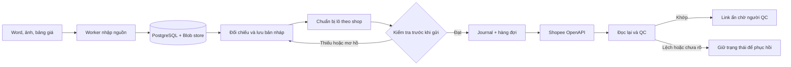

# Shopee Bulk Listing Workspace

[](.node-version)
[](tsconfig.base.json)
[](apps/web)
[](infra/local/compose.yaml)
[](https://github.com/HoangDuong-DH/shopee_update/actions/workflows/check.yml)

Ứng dụng nội bộ để chuẩn hóa dữ liệu sản phẩm, chuẩn bị lô và đăng hoặc cập nhật nhiều listing Shopee qua OpenAPI. Hệ thống giữ liên kết từ dữ liệu trên sàn về đúng Word, ảnh và dòng SKU/giá nguồn để người vận hành có thể kiểm tra, phục hồi và tiếp tục công việc mà không phải nhập lại từng sản phẩm.

> **Trạng thái:** đang được phát triển và vận hành có kiểm soát. Các thao tác ghi production bị khóa theo shop, quyền và cấu hình máy chủ. Kết quả chạy thử tại máy không được coi là bằng chứng sản phẩm đã được Shopee chấp nhận.

## Bài toán hệ thống giải quyết

Đăng hàng loạt không chỉ là lặp một lệnh tạo sản phẩm. Mỗi listing còn phải khớp ảnh, nội dung, phân loại, SKU, giá, tồn kho, ngành hàng, thuộc tính và kênh vận chuyển của đúng shop. Một request thành công cũng chưa đủ: dữ liệu có thể chỉ được tạo một phần hoặc được Shopee chuẩn hóa khác với dữ liệu gửi lên.

Workspace xây dựng một quy trình có thể kiểm chứng:

1. Nhận Word, ảnh và bảng giá từ thư mục nguồn.
2. Ghép từng lựa chọn bán với SKU và giá có bằng chứng.
3. Cho người vận hành xem và sửa mapping trước khi đăng.
4. Đóng băng một bản chuẩn bị có phiên bản cho đúng shop.
5. Tạo listing ẩn theo lô, giữ nhịp gọi API và chống gửi lặp.
6. Đọc lại từ Shopee để đối chiếu trước khi đánh dấu hoàn tất.
7. Chuyển link ẩn cho người QC bổ sung và quyết định mở bán.

## Chức năng chính

- **Kho đầu vào:** nhận nhiều thư mục listing, workbook giá dùng chung, Word và ảnh; lưu tệp theo SHA-256 để tránh ghi đè nguồn.
- **Nhận diện ảnh:** hỗ trợ ảnh bìa, ảnh sản phẩm, ảnh phân loại và ảnh mô tả; lưu lựa chọn tay và thứ tự ảnh theo từng listing.
- **Ánh xạ SKU và giá:** đối chiếu theo bộ giá, sheet, cột giá và dòng nguồn; giữ trạng thái thiếu hoặc mơ hồ thay vì tự tạo SKU.
- **Bản nháp có phiên bản:** nội dung, ảnh và cấu trúc phân loại được lưu bền trong PostgreSQL; thay đổi đồng thời được phát hiện bằng kiểm tra revision.
- **Chuẩn bị theo shop:** đọc metadata ngành hàng, thương hiệu, thuộc tính và logistics từ kết nối của chính shop.
- **Đăng theo lô:** chia công việc thành nhóm nhỏ, ghi journal trước khi gửi và dùng khóa để ngăn hai worker xử lý cùng mục tiêu.
- **Đăng ẩn để QC:** tạo sản phẩm ở trạng thái ẩn, hiển thị tiến độ từng listing và tách bước mở bán khỏi bước tạo link.
- **Đối chiếu sau ghi:** kiểm tra lại tiêu đề, ảnh, phân loại, SKU, giá, tồn và trạng thái; phản hồi chưa rõ không được tự động gửi lại.
- **Nhập bộ cập nhật:** chuẩn bị thay đổi có phạm vi cho giá, tồn, nội dung hoặc ảnh mà không cần nhập lại toàn bộ listing.
- **Kho kiến thức Shopee:** tra tài liệu Open Platform và Seller Education đã lưu tại máy, kèm nguồn và ngày thu thập.

## Luồng tổng thể



Hệ thống ưu tiên tính đúng và khả năng phục hồi hơn tốc độ gửi thuần túy. Một listing dự kiến có phân loại chỉ hoàn tất khi dữ liệu đọc lại có đủ phân loại và SKU tương ứng; việc chỉ nhận được `item_id` không đồng nghĩa listing đã sẵn sàng.

## Nguyên tắc an toàn dữ liệu

- Không tự tạo SKU bán hàng. SKU phải truy được về dòng dữ liệu nguồn đã chọn.
- Không dùng tên tệp, tên ảnh hoặc listing cũ làm bằng chứng duy nhất cho ngành hàng, giá hay thuộc tính.
- Không xem HTTP `200` hoặc ACK là kết quả cuối; mọi phép ghi quan trọng đều cần đọc lại.
- Không tự phát lại request có kết quả chưa xác định vì có thể tạo listing trùng.
- Không tự mở bán. Tạo link ẩn và mở bán là hai quyết định riêng.
- Không đưa token, partner key, dữ liệu shop, workbook hay ảnh riêng vào Git.
- Credentials được mã hóa ở server và không được trả lại giao diện sau khi lưu.
- Các giới hạn API được lấy từ tài liệu hoặc phản hồi thật của Shopee, không lấy giá trị ví dụ làm quota chung.

## Kiến trúc

Đây là npm workspace dùng TypeScript end-to-end:

| Thành phần             | Vai trò                                                                                     |
| ---------------------- | ------------------------------------------------------------------------------------------- |
| `apps/web`             | Giao diện React/Vite cho nhập nguồn, mapping, chuẩn bị lô, kết nối shop và theo dõi tiến độ |
| `apps/api`             | API NestJS/Fastify, validation phía server, quản lý kết nối và điều phối nghiệp vụ          |
| `apps/worker`          | Worker nhập nguồn và các công việc nền đã được xếp hàng rõ ràng                             |
| `packages/domain`      | Contract, kiểu dữ liệu và quy tắc nghiệp vụ dùng chung                                      |
| `packages/persistence` | PostgreSQL repositories, migrations và blob store                                           |
| `packages/shopee`      | Ký request, transport OpenAPI, codec payload và logic đọc lại/QC                            |
| `knowledge-base`       | Bản chụp tài liệu Shopee dùng để đối chiếu kỹ thuật; không được commit mặc định             |
| `docs`                 | Runbook, hướng dẫn vận hành, thiết kế, review và hồ sơ bàn giao                             |

PostgreSQL là nguồn trạng thái công việc có thẩm quyền. Tệp gốc nằm trong blob store; UI không giữ một bản trạng thái riêng để thay thế server.

## Yêu cầu

- Windows 10/11 hoặc môi trường tương thích PowerShell
- Node.js **24.20.x** và npm
- Docker Desktop chạy Linux containers
- Tài khoản Shopee Open Platform và shop đã cấp quyền nếu cần dùng chức năng API thật

Phiên bản Node được ghim trong [`.node-version`](.node-version). PostgreSQL local dùng image `postgres:17.11-alpine`.

## Khởi động tại máy

```powershell
git clone https://github.com/HoangDuong-DH/shopee_update.git
cd shopee_update
npm ci
npm run setup:local
docker compose --env-file .local/docker.env -f infra/local/compose.yaml up -d postgres
npm run db:migrate
npm run dev
```

Mở [http://127.0.0.1:5173](http://127.0.0.1:5173). Các dịch vụ mặc định:

| Dịch vụ    | Địa chỉ                 |
| ---------- | ----------------------- |
| Web        | `http://127.0.0.1:5173` |
| API        | `http://127.0.0.1:4310` |
| PostgreSQL | `127.0.0.1:5442`        |

`npm run setup:local` tạo mật khẩu database và khóa mã hóa ngẫu nhiên khi máy chưa có cấu hình. Nếu `.env` đã tồn tại, script giữ nguyên tệp đó và không in secrets ra terminal.

### Cấu hình quan trọng

Sao chép từ [`.env.example`](.env.example) khi cần cấu hình thủ công.

| Biến                       | Mục đích                              |
| -------------------------- | ------------------------------------- |
| `DATABASE_URL`             | Kết nối PostgreSQL                    |
| `DATA_ROOT`                | Nơi lưu blob và dữ liệu runtime riêng |
| `APP_ENCRYPTION_KEY`       | Mã hóa credentials đã lưu             |
| `ALLOWED_ORIGINS`          | Danh sách origin được phép gọi API    |
| `SHOPEE_PRODUCTION_WRITES` | Cờ bảo vệ các lệnh ghi production     |

Không commit `.env`, `.local/`, dữ liệu nguồn hoặc khóa API.

## Lệnh thường dùng

```powershell
npm run dev             # Chạy API, worker và giao diện
npm run db:migrate      # Áp dụng migration PostgreSQL
npm run typecheck       # Kiểm tra kiểu TypeScript
npm run build           # Build toàn bộ ứng dụng
npm run test            # Legacy + unit + integration
node scripts/verify.mjs # Chuỗi kiểm tra đầy đủ dùng trong CI
npm run test:e2e        # Kiểm tra trình duyệt khi app local đang chạy
```

Test integration dùng PostgreSQL thật trong schema riêng. Browser fixtures chặn kết nối ngoài localhost và không gửi lệnh lên Shopee.

## Cách sử dụng

1. Vào **Kho listing → Nhập Word / ảnh / bảng giá** để nhận nguồn.
2. Kiểm tra ảnh bìa, ảnh mô tả, ảnh phân loại, cấu trúc lựa chọn bán và SKU/giá.
3. Lưu bộ listing; bản lưu có thể mở lại mà không cần chọn lại thư mục.
4. Vào **Đăng hàng → Chuẩn bị lô mới**, chọn shop và các listing cần tạo.
5. Xem các trường còn thiếu hoặc bị chặn, sau đó đăng ký lô.
6. Theo dõi **Đợt đang làm**; hệ thống hiển thị trạng thái riêng cho từng listing.
7. Khi tạo link ẩn thành công, mở link Shopee để QC và chỉ mở bán sau khi dữ liệu đạt yêu cầu.

Hướng dẫn chi tiết: [Đăng hàng từ bộ listing đã lưu](docs/operator-guides/dang-hang-tu-bo-listing-da-luu.md).

## Phạm vi hiện tại

Đã có luồng production có kiểm soát từ listing đã lưu đến tạo listing ẩn và đọc lại. Tuy nhiên, khả năng dùng được còn phụ thuộc quyền của từng partner/shop, ngành hàng, metadata bắt buộc và API Shopee tại thời điểm chạy.

Các phần chưa nên suy rộng từ kết quả hiện có:

- Chưa coi hệ thống là đã nghiệm thu cho mọi shop, mọi ngành hàng hoặc vận hành liên tục 24 giờ.
- Một số kiểu cập nhật listing hiện có vẫn cần quy trình riêng.
- Size chart, video, chứng từ và các ngành hạn chế có thể cần thao tác hoặc phê duyệt bổ sung.
- Tự động retry chỉ phù hợp với lỗi được phân loại là tạm thời; kết quả không xác định phải được đối chiếu trước.
- Không có cơ chế tự sửa dữ liệu nguồn để vượt validation của Shopee.

Xem [handoff hiện hành](docs/handoffs/PROJECT_HANDOFF.md) để biết ranh giới vận hành đã công bố và [hướng dẫn chạy local](docs/runbooks/local-development.md) để xử lý lỗi môi trường.

## Tài liệu

- [Hướng dẫn chạy và điều tra lỗi](docs/runbooks/local-development.md)
- [Đăng hàng từ bộ listing đã lưu](docs/operator-guides/dang-hang-tu-bo-listing-da-luu.md)
- [Chuẩn bị bộ listing](docs/operator-guides/chuan-bi-bo-listing.md)
- [Nhập bộ cập nhật](docs/runbooks/import-updates.md)
- [Kết nối sandbox](docs/runbooks/sandbox-connection.md)
- [Thiết kế workflow production](docs/superpowers/specs/2026-09-15-production-workflow-design.md)
- [Quy tắc tra cứu kiến thức Shopee](AGENTS.md)
- [Handoff hiện hành](docs/handoffs/PROJECT_HANDOFF.md)
- [Harness dẫn model quản lý hệ thống](docs/ai/MODEL_MANAGEMENT_HARNESS.md)
- [Skill vận hành listing](skills/shopee-uploader-operator/SKILL.md)
- [Skill cập nhật handoff](skills/shopee-uploader-handoff/SKILL.md)

Các báo cáo theo ngày và bằng chứng chứa dữ liệu vận hành được giữ local. GitHub chỉ công bố handoff hiện hành, các runbook ổn định và hành lang quản lý dành cho model.

## CI và đóng góp

GitHub Actions chạy typecheck, build, unit/integration tests và kiểm tra dependency mức `high` trên mỗi push hoặc pull request. Trước khi gửi thay đổi:

1. Không thêm credentials hoặc dữ liệu shop thật vào commit.
2. Cập nhật contract ở cả backend và frontend nếu API thay đổi.
3. Chạy `node scripts/verify.mjs`.
4. Mô tả rõ kiểm thử nào chỉ dùng fixture và kiểm thử nào đã đọc hoặc ghi API thật.

Repository hiện phục vụ quy trình nội bộ và chưa công bố giấy phép nguồn mở. Shopee và các nhãn hiệu liên quan thuộc về chủ sở hữu tương ứng; dự án này không phải sản phẩm chính thức của Shopee.
