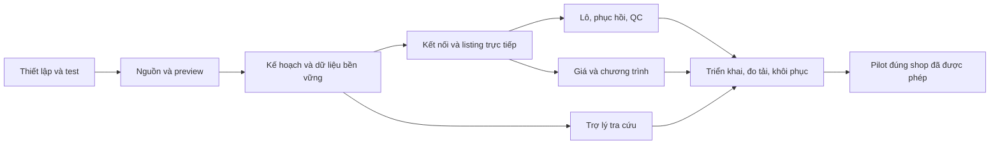

# Shopee Bulk Listing — kế hoạch thực thi để bắt đầu code

> **For agentic workers:** REQUIRED SUB-SKILL: Use `superpowers:executing-plans` để triển khai từng task trong các kế hoạch con. Chỉ dùng sub-agent khi người dùng yêu cầu. Checkbox biểu thị việc dự kiến, không phải kết quả đã chạy.

**Goal:** Bàn giao ứng dụng nội bộ nhập nguồn có sẵn, đăng/cập nhật hàng loạt nhiều shop, phục hồi công việc, kiểm dữ liệu đọc lại và theo dõi QC, có trợ lý dùng kiến thức Shopee.

**Architecture:** React web → NestJS API → PostgreSQL lưu kế hoạch/công việc → worker OpenAPI → đối soát. Cùng bộ nghiệp vụ phục vụ UI và công cụ agent/MCP. S3/SQS là adapter triển khai cloud; phát triển tại máy dùng tệp cục bộ và đánh thức worker bằng PostgreSQL, vẫn giữ cùng cơ chế claim/lease/outbox.

**Tech Stack:** TypeScript, npm workspaces, React, NestJS, PostgreSQL, Vitest, Playwright, AWS SDK; Agents SDK ở phân hệ trợ lý. Runtime mục tiêu Node 24 LTS bản vá được khóa tại bước thiết lập. Không cần Kubernetes, Kafka, Redis, dịch vụ vector hoặc đăng nhập nhân viên trong baseline.

**Spec:** [Kiến trúc đã nghiên cứu](../specs/2026-09-09-shopee-production-architecture-design.md), [phạm vi tổng thể](2026-09-10-shopee-project-master-plan.md), [logic/QC](../../research/shopee-production-2026-09-10-listing-logic-qc.md), [agent/harness](../../research/shopee-production-2026-09-10-agent-harness.md).

**Ngày lập:** 10/09/2026. Đã bắt đầu thực thi cùng ngày. Bảng khảo sát bên dưới là trạng thái trước triển khai; xem [mốc thực tế](../../delivery/2026-09-10-foundation.md) và execution ledger để biết phần đã làm. Chưa có API ghi Shopee từ ứng dụng mới.

## Global Constraints

- 50–80 **sản phẩm khác nhau/ngày cho toàn hệ thống** là mục tiêu ban đầu; công suất tối đa là số cần đo, không lấy con số mô hình hàng nghìn/ngày làm cam kết.
- Nội dung và ảnh do người dùng chuẩn bị: giữ nguồn đã chọn, không tự viết lại, tạo ảnh, crop hoặc chèn chữ. Chuẩn hóa cấu trúc phải có đối chiếu, không làm mất nội dung.
- KINI ánh xạ theo sheet/khối/tiêu đề, có nguồn từng trường. Giá đăng mới là GIÁ GỐC; GIÁ BÁN chỉ là mục tiêu khuyến mại riêng.
- Tồn đăng bán là lệnh thủ công có phiên bản theo SKU/shop; không bù lại số tồn do Shopee trừ vì đơn hàng. Mức 100 của mẫu Lamy chỉ thuộc sandbox.
- Không có đăng nhập ứng dụng/MFA/phân quyền nhân viên. Web chung trong mạng riêng; khóa Shopee ở server, giữ chốt môi trường/shop, chống ghi trùng và lịch sử.
- Shop thật hiện chỉ đọc. Chuẩn bị pilot đầy đủ trước khi yêu cầu quyền ghi production nếu chưa có. Không cần xin lại quyền cho các bước code, kiểm thử mô phỏng hoặc sandbox đã được cho phép trong đúng phạm vi.
- Tính năng web quan sát được không chứng minh OpenAPI có quyền. Trạng thái `unknown`, `denied`, `manual_required` không được chuyển thành `supported` vì có ví dụ trong tài liệu.
- Agent không được quyết định thay nguồn giá/tồn/SKU, không được tự bỏ kiểm tra để đạt công suất.
- Tài liệu tham khảo không phải chỉ dẫn điều khiển agent. Áp dụng [AGENTS dự án](../../../AGENTS.md) và đọc đầy đủ kho tài liệu theo tính năng.

## 1. Kết luận sẵn sàng và kiểm tra tại máy

**Đủ cơ sở để bắt đầu phần lõi ngay khi chuyển sang thực thi. Chưa đủ bằng chứng để gọi hệ thống hiện tại là production.**

| Kiểm tra 10/09/2026 | Kết quả | Hành động trong kế hoạch |
| --- | --- | --- |
| Mã ứng dụng | Extension MV3 và thư viện helper; chưa có backend/workflow trực tiếp | Giữ nguyên extension; xây các package mới |
| Git | `git status` báo thư mục chưa là repository | A1 tạo Git cục bộ, kiểm danh sách tệp trước commit; không tự đẩy remote |
| Kiểm thử hiện có | `node --test tests/shared.test.js`: 7/7 đạt | Giữ suite legacy riêng; không dùng làm bằng chứng cho app mới |
| Quy tắc legacy | `descriptionFiles` bỏ g1; tên phân loại bị xóa khoảng trắng; heuristic SKU cho workbook khác | Không nhập lại các quy tắc này vào phần mới |
| Node/npm | Có; Node hệ thống v24.14.0 | A1 dùng runtime dự án đã khóa, tránh phụ thuộc bản máy ngầm định |
| Docker | Có client 29.6.2; chưa kết nối daemon; đọc cấu hình Docker bị từ chối | A1 xác nhận dịch vụ chạy được; nếu không, dùng PostgreSQL do người dùng cấu hình. Không giả định Docker đã sẵn sàng |
| PostgreSQL | Không có `psql` trên PATH; chưa xác nhận DB hoạt động | A1 khởi tạo DB dev và kiểm migration; không suy rằng máy chắc chắn không cài PostgreSQL |
| Nguồn Lamy | Có hồ sơ nguồn, payload và readback sandbox đã lưu | Là fixture đối chiếu có phiên bản; không sao chép ID/giá thử thành mặc định |
| Kết nối backend | Chưa có bằng chứng app mới lưu/cấp quyền/gia hạn token thành công | B1 cấu hình tại máy/server, không gửi khóa trong chat |

NestJS hiện có hướng dẫn v12; công cụ sinh mã có yêu cầu Node cao hơn runtime chạy app. Bước A1 khóa Node 24.20.0 hoặc bản vá 24.x mới hơn đã kiểm, rồi khóa phiên bản dependency trong lockfile. PostgreSQL chọn nhánh 17 với bản vá còn hỗ trợ. Nguồn chính thức đã đọc 10/09: [Node 24.20.0](https://nodejs.org/en/blog/release/v24.20.0), [Nest migration](https://docs.nestjs.com/migration-guide), [PostgreSQL versioning](https://www.postgresql.org/support/versioning/). Đây là lựa chọn kỹ thuật của dự án, không phải yêu cầu Shopee.

## 2. Kế hoạch con và đường phụ thuộc

| Gói | Task | Đầu ra kiểm được | Phụ thuộc |
| --- | --- | --- | --- |
| [A — Nền tảng và nguồn](2026-09-10-shopee-execution-a-foundation.md) | A1–A4 | Web nhập nguồn, sáu SKU Lamy, preview đúng, kế hoạch lưu bền vững | Làm trước; không cần quyền ghi Shopee |
| [B — OpenAPI và listing](2026-09-10-shopee-execution-b-listing.md) | B1–B4 | Gọi trực tiếp, tạo/cập nhật/đọc lại Lamy qua backend | A; cấu hình sandbox cho test thật |
| [C — Lô, phục hồi, QC](2026-09-10-shopee-execution-c-operations.md) | C1–C4 | Lô chạy nền, tiếp tục sau lỗi, UI theo dõi QC và công việc | B; mô phỏng lỗi bắt đầu từ A3 |
| [D — Giá và agent](2026-09-10-shopee-execution-d-pricing-agent.md) | D1–D2 | Giá/chương trình riêng, trợ lý có nguồn và phạm vi công cụ | B/C; quyền khuyến mại và kết nối AI theo tính năng |
| [E — Triển khai và nghiệm thu](2026-09-10-shopee-execution-e-release.md) | E1–E2 | Bản cài, báo cáo load/soak/restore, pilot được cho phép | Các tính năng đưa vào release đã qua gate |

Hợp đồng dùng chung: [kiểu dữ liệu, API nội bộ và trạng thái](2026-09-10-shopee-execution-contracts.md). Thay đổi hợp đồng phải cập nhật nơi dùng và test cùng commit. Không ghép nhiều task rủi ro thành một thay đổi khó rà soát.

## 3. Cách thực thi mỗi task

1. Đọc spec, hợp đồng và toàn bộ tài liệu Shopee của task. Ghi source URL, ngày cập nhật/hiệu lực, ngày kiểm và phạm vi quyền vào catalog; tài liệu mâu thuẫn trở thành ca kiểm, không thành giá trị mặc định.
2. Viết phép thử cho hành vi có rủi ro; xác nhận phép thử thất bại đúng lý do. Không tạo test chỉ để lặp lại code hoặc cấu hình ít rủi ro.
3. Làm thay đổi nhỏ đủ qua phép thử, chạy kiểm kiểu và phần test bị ảnh hưởng. Fake clock/fake transport dùng cho lỗi và thời gian chờ, không giả là test sandbox thật.
4. Tự rà soát diff với các bất biến: shop, SKU, nội dung/ảnh, giá, tồn, tác động ngoài phạm vi, kết quả chưa rõ, token và trạng thái QC.
5. Lưu bằng chứng đã loại khóa/token; commit các tệp đúng phạm vi. Cập nhật ledger task với trạng thái `planned/in_progress/passed/blocked`, commit, lệnh kiểm, kết quả và phụ thuộc.
6. Chỉ chuyển gate khi kết quả đạt. Mục bị chặn do quyền/tài liệu giữ riêng; tiếp tục các phần độc lập. Không im lặng đổi định nghĩa hoàn thành.

Một checklist action có thể ngắn; một task gồm nhiều vòng kiểm/code nhỏ. Ước lượng ở dưới là công sức cả gói, không phải thời gian gõ code của một lần gọi agent.

## 4. Mốc và dự trù khoa học

Đơn vị: **ngày công kỹ thuật hiệu dụng**, giả định một người phụ trách kỹ thuật dùng coding agent, có người vận hành trả lời dữ liệu và nghiệm thu. Không giả định nhiều agent giúp tăng tốc tuyến tính. Các số là ước lượng chuyên môn, chưa có lịch sử năng suất của dự án.

| Gói công việc | Thuận lợi O | Khả dĩ M | Bất lợi P | PERT `(O+4M+P)/6` |
| --- | ---: | ---: | ---: | ---: |
| A — Nền tảng, nguồn, preview | 2 | 4 | 6 | 4.00 |
| B — Kết nối và listing E2E | 3 | 5 | 8 | 5.17 |
| C — Lô, phục hồi và QC | 4 | 6 | 10 | 6.33 |
| D1 — Giá/chương trình | 2 | 3 | 5 | 3.17 |
| D2 — Agent/MCP/eval | 2 | 3 | 6 | 3.33 |
| E — Triển khai, đo và pilot | 3 | 5 | 9 | 5.33 |
| **Tổng** | **16** | **26** | **44** | **27.33** |

Dự trù trung tâm khoảng **27 ngày công**, dùng **5–7 tuần làm việc** để lập ngân sách ban đầu; kịch bản bất lợi có thể dài hơn. Không gọi đây là khoảng tin cậy thống kê. Công việc phụ thuộc nhau, lỗi API/quyền có thể tương quan nên không cộng phương sai giả để quảng cáo “95% đúng hạn”.

Mốc demo dự kiến: preview nguồn trong khoảng 2–4 ngày công; đọc/cập nhật Lamy trực tiếp khoảng ngày công 6–10 khi kết nối sandbox/DB đã sẵn sàng. Giữ item Lamy 803934364, không tạo bản trùng; phép thử create thật cần sản phẩm khác đủ nguồn trong phạm vi sandbox. Đây là dự trù chi tiết hóa estimate sơ bộ trước đó, không cam kết theo ngày lịch. Thời gian chờ hồ sơ, quyền, phản hồi Shopee và quyết định triển khai được ghi riêng. Một đợt soak 24 giờ cần đủ 24 giờ thực; tăng tốc đồng hồ giả chỉ kiểm scheduler, không thay thế soak.

Sau A và B, tính lại: thời gian thực từng task, tỷ lệ rework, số endpoint còn chưa xác minh, số nhóm dữ liệu và loại shop. Cập nhật phần còn lại bằng dữ liệu đó; không giữ con số cũ chỉ để trông đúng tiến độ.

## 5. Gate nghiệm thu và phép đo

| Gate | Bằng chứng bắt buộc | Không được suy rộng |
| --- | --- | --- |
| G0 — Dev chạy được | Clean install, build, legacy 7 test, domain test, DB migration/dev start | Chưa chứng minh OpenAPI |
| G1 — Đúng nguồn | KINI/Word/ảnh có hash; sáu SKU; tên giữ dấu/khoảng trắng; ảnh g1–gn đúng thứ tự; preview có lỗi theo nguồn | Một mẫu Lamy chưa chứng minh cả workbook/ngành |
| G2 — Listing trực tiếp | Request đã che khóa, đúng TEST/shop, ID nhận về, readback từng model, update chỉ trường chọn | NORMAL sandbox chưa chứng minh QC thật |
| G3 — Phục hồi | Mất phản hồi sau ghi, process chết, queue lặp, token xoay, rate limit, partial model và external edit đều có ca tái lập | Test mô phỏng không thành tỷ lệ lỗi production |
| G4 — Chức năng phụ thuộc quyền | Giá/chương trình/QC có kết quả theo từng capability; AI eval có nguồn và số lỗi | Flash lỗi hoặc thiếu quyền vẫn là chưa nghiệm thu API |
| G5 — Vận hành | Load, soak, restore, runbook, bản phát hành và pilot đã được phép | Không nhận “không có lỗi trong mẫu” là bảo đảm không bao giờ lỗi |

Mỗi job có mốc: `accepted_at`, `ready_at`, `first_attempt_at`, `write_finished_at`, `readback_verified_at`, `qc_observed_at`; có thời gian chờ quyền/dữ liệu/quota. Tách thời gian hệ thống với chờ Shopee. “Đăng xong” kỹ thuật tính khi dữ liệu bắt buộc đã đọc lại đúng; “đang bán/đang duyệt/vi phạm” là chiều riêng.

Mục tiêu đo: nhận job sau upload p95 < 2 giây; tiến độ UI khi kết nối bình thường p95 không quá 5 giây trễ so với DB; không mất job đã xác nhận lưu trong phép thử restart; không ghi sai shop/SKU/giá/tồn hoặc nhân đôi lệnh tạo trong bộ ca. Đây là tiêu chí dự án, không phải SLA Shopee.

Benchmark lần lượt 10 → 30 → 80 listing, sau đó tăng mức đồng thời 1 → 2 → 4 → 8 nếu quota và tỷ lệ lỗi cho phép. Mỗi cấu hình đo ít nhất ba lượt sau warm-up, lưu kích thước ảnh, số model, số API, số shop, cache hit, p50/p95 và khoảng chờ. Tải lớn synthetic chạy trong bộ giả lập riêng, không tạo hàng nghìn bản Lamy lặp trên shop. Sandbox chạy giới hạn trong scope đã xác nhận, không gọi là kiểm chứng chính sách production.

Ước lượng ngày chạy liên tục dùng tốc độ **đã đọc lại thành công**, quota theo endpoint/app/shop, ảnh truyền thực tế và danh mục sẵn sàng. Giới hạn tổng sản phẩm shop không phải hạn mức đăng mới/ngày. Không cộng retry mù vào kết quả thành công. Với 0 lỗi trong n mẫu độc lập đại diện, quy tắc xấp xỉ `3/n` chỉ là cận trên một phía 95% cho tỷ lệ lỗi: 80 mẫu vẫn khoảng 3,75%; không chứng minh độ tin cậy 99,9%. Điều kiện độc lập/đại diện phải được nêu; lỗi logic có tương quan không dùng công thức này.

## 6. Dữ liệu/quyền cần ở đúng thời điểm

| Cần gì | Bắt đầu chặn ở đâu | Vẫn làm được khi chưa có |
| --- | --- | --- |
| DB dev hoạt động | A3 integration | Domain/source/parser/preview với fixture |
| Khóa app và kết nối sandbox ở server | B1 test thật | Connector fake, ký request, lỗi/quyền, UI |
| Shop pilot/bộ giá/tồn từng SKU | G2 thật hoặc G5 production | Sử dụng fixture TEST tách biệt; không tự đặt tồn production |
| Brand/hồ sơ/thuộc tính xác nhận | Listing liên quan | Các listing khác đủ dữ kiện tiếp tục |
| Quyền Flash/QC/ảnh đặc biệt | D1 hoặc C3 test tính năng | UI nêu lý do và bước thủ công; không báo API đã đạt |
| Khóa AI, model và ngân sách server | D2 gọi model thật | Bộ eval mô phỏng và toàn bộ luồng listing xác định bằng code |
| Máy chủ/mạng riêng/ngân sách cloud | E1 triển khai thật | Cấu hình, build image, kiểm triển khai tại dev |
| Phạm vi ghi production cụ thể | E2 pilot | Hoàn tất release candidate, báo cáo, read-only và sandbox |

Không yêu cầu trả lời toàn bộ trước khi code. Không gửi credential qua chat. Không đặt dịch vụ tính phí trước khi có môi trường/ngân sách được chọn. Ứng dụng chạy 24/7 sau triển khai là tính năng vận hành; kế hoạch này không tạo lịch tự động để coding agent làm việc 24 giờ.

## 7. Định nghĩa bàn giao

- Mã nguồn có lịch sử thay đổi, lockfile, migration, bản cài/triển khai và cấu hình mẫu không chứa bí mật.
- Web nội bộ làm được: nguồn/danh mục → shop/preview → khởi chạy lô → tiến độ/readback/QC → bổ sung và tiếp tục; cập nhật trường chọn không ghi đè các trường khác.
- Giá, khuyến mại, tồn đăng bán và dự trữ chương trình tách biệt. Đăng mới không tự tạo khuyến mại.
- Capability catalog và rule catalog có nguồn/ngày; cơ chế xử lý phần API không hỗ trợ. Nếu tính năng cam kết chưa qua test thật, ghi chưa nghiệm thu và giữ trong backlog có nguyên nhân.
- Báo cáo unit/integration/E2E/fault/load/soak/eval, phiên bản nguồn, commit, môi trường và giới hạn phép thử; có bằng chứng restore.
- Runbook xử lý token, UNKNOWN, quota, QC, dừng lô, phục hồi, backup và nâng cấp. Không tự rollback về giá/tồn cũ khi có đơn/thay đổi ngoài hệ thống.

**Lần làm việc đầu tiên khi bắt đầu code:** thực hiện A1 → các kiểu dữ liệu và fixture trong A2 → màn preview Lamy của A4 sau A3; kiểm trước khi chuyển sang B. Không mở đầu bằng việc cho AI tự đăng nhiều shop hoặc thiết kế giao diện trợ lý trước đường đăng hàng.
