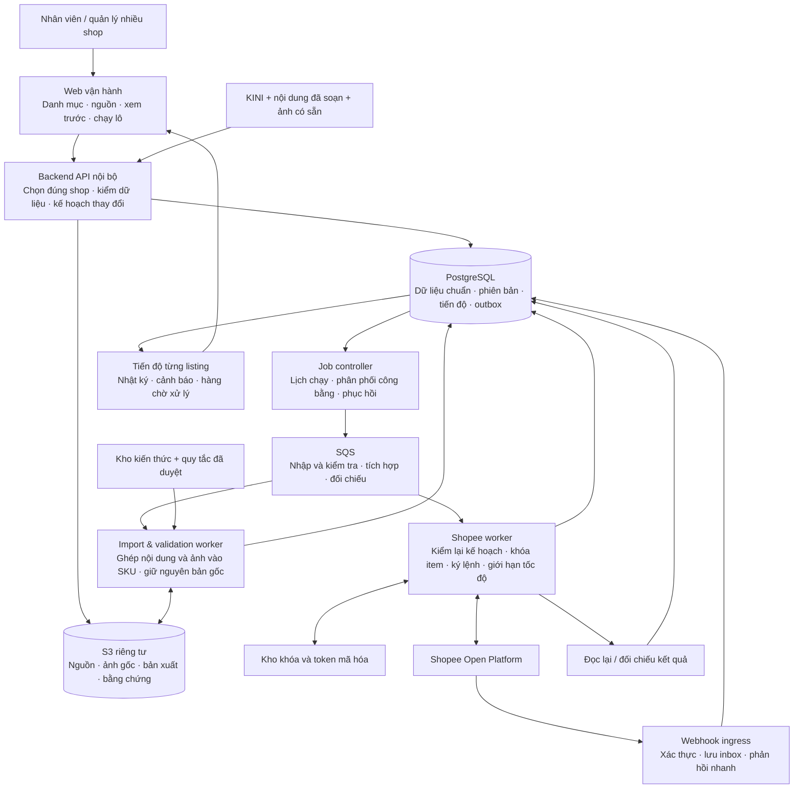
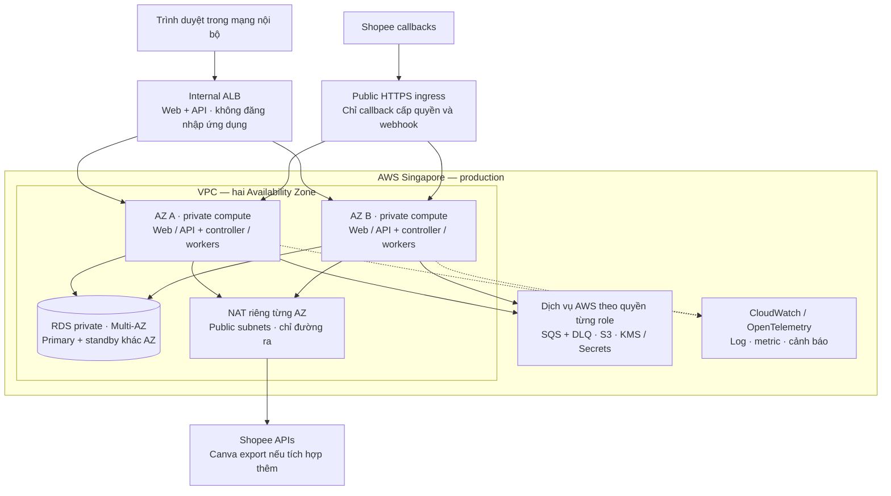
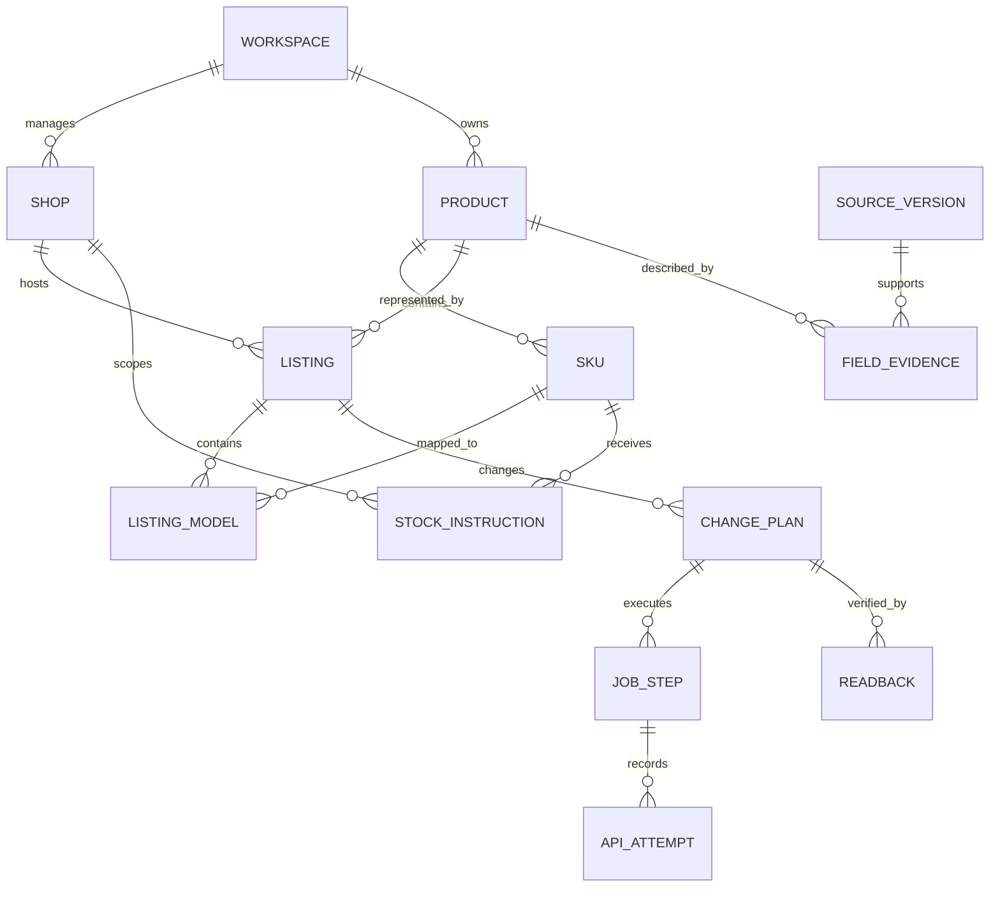
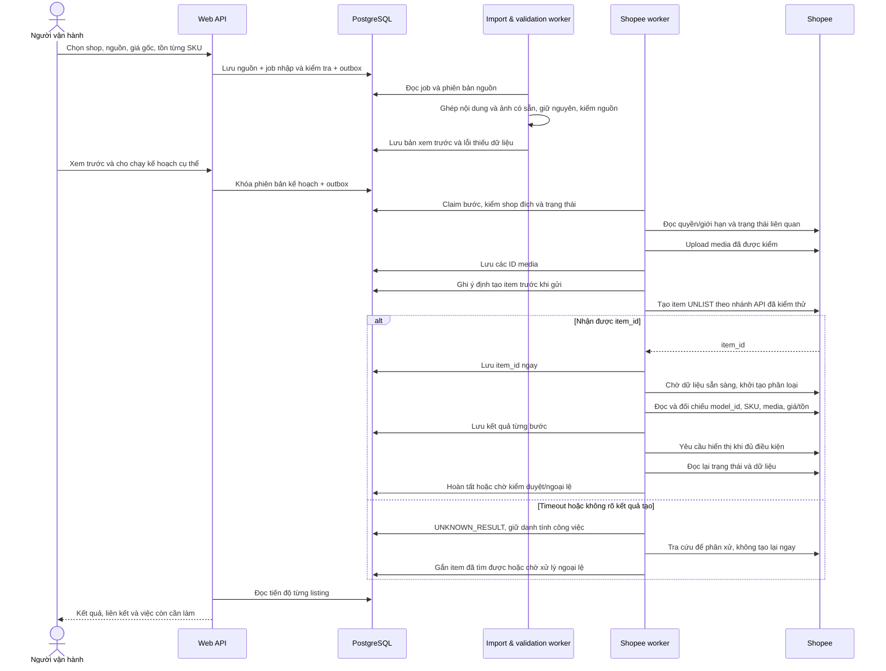
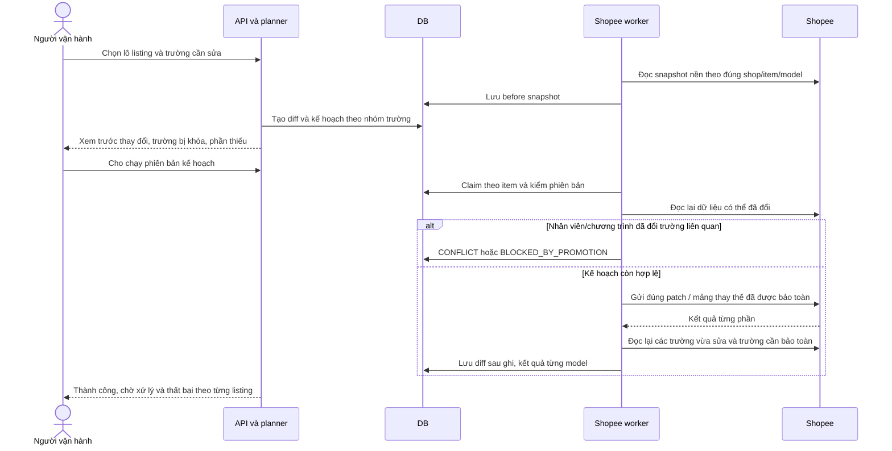
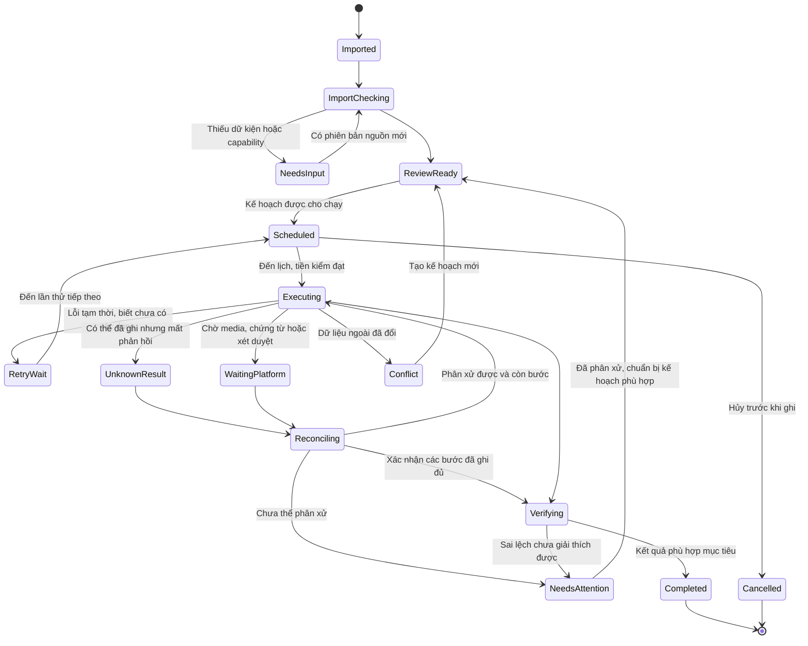
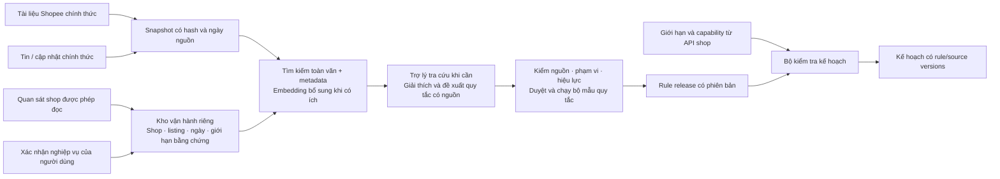

# Kiến trúc ứng dụng Shopee đăng và cập nhật hàng loạt

Phiên bản thiết kế **09/09/2026, chỉnh phạm vi theo phản hồi người dùng**. Phạm vi: ứng dụng nội bộ phục vụ nhiều shop Việt Nam, có Mall và shop thường; mục tiêu 50–80 sản phẩm khác nhau/ngày cho toàn hệ thống. Dùng nội dung và ảnh đã được đội vận hành chuẩn bị; bản đầu không có đăng nhập ứng dụng, MFA hoặc phân quyền nhân viên. Công suất theo từng shop có thể cấu hình sau. Đây là **kiến trúc đề xuất để triển khai và nghiệm thu**, chưa có hạ tầng cloud hoặc luồng ghi Shopee nào được triển khai trong lượt này.

Tài liệu gồm 7 sơ đồ: hệ thống, triển khai, dữ liệu, tạo listing, cập nhật listing, trạng thái công việc và kiến thức. Các khối trong sơ đồ là trách nhiệm hoặc vai trò chạy; không có nghĩa mỗi khối là một microservice độc lập.

Bổ sung nghiên cứu ngày 10/09/2026: [logic đăng hàng và QC](../../research/shopee-production-2026-09-10-listing-logic-qc.md), [agent, harness, multi-agent, MCP và SDK](../../research/shopee-production-2026-09-10-agent-harness.md). Lớp AI đề xuất hỗ trợ tra cứu, phân giải dữ kiện và điều tra lỗi; backend giữ quyền thực thi kế hoạch và đối soát Shopee. Các bổ sung này chưa triển khai hoặc nghiệm thu production.

[Kế hoạch tổng thể dự án ngày 10/09/2026](../plans/2026-09-10-shopee-project-master-plan.md) tổng hợp phạm vi đã chốt, hiện trạng bằng chứng, bảy mốc triển khai, các phụ thuộc và định nghĩa hoàn thành.

## 1. Quyết định kiến trúc và phạm vi

**Phương án chọn:** backend TypeScript chia module, các worker chạy riêng, PostgreSQL làm nguồn trạng thái, SQS làm hàng đợi, S3 lưu tài nguyên; triển khai tham chiếu trên AWS Singapore, hai Availability Zone. Frontend React mở trực tiếp trong mạng nội bộ. Luồng chính là nhập tài nguyên có sẵn → ghép đúng sản phẩm/SKU → kiểm tra → xem trước → đăng/cập nhật → đọc lại kết quả. Không cần dịch vụ tạo nội dung, tạo ảnh hoặc OCR để chạy luồng này.

| Phương án | Lợi thế | Trách nhiệm vận hành | Quyết định |
| --- | --- | --- | --- |
| AWS managed: ECS Fargate, RDS, SQS, S3 | Tách tải web/worker, có cơ chế dự phòng và phục hồi được quản lý | Thiết lập mạng, IAM, giám sát, kiểm thử phục hồi; chi phí nền cao hơn | Chọn làm thiết kế tham chiếu production |
| Container trên máy chủ do đội tự quản + PostgreSQL managed | Dễ bắt đầu với ngân sách nhỏ, giữ được mô hình dữ liệu/công việc tương tự | Đội tự quản host, vá lỗi, dự phòng compute và xử lý sự cố | Phương án thay thế nếu đã có đội/hạ tầng phù hợp |

Ở công suất mục tiêu, chưa có bằng chứng cần Kubernetes, Kafka, một vector database riêng hoặc tách tất cả nghiệp vụ thành các dịch vụ độc lập. Ranh giới module được giữ rõ để có thể tách sau khi đo được điểm nghẽn. Hệ thống hiện có trong repository chủ yếu là extension điền form; không coi nó là backend production đã tồn tại.

**Các quyết định nghiệp vụ đã xác nhận:**

- Nội dung và ảnh do đội vận hành tạo sẵn. Ứng dụng giữ nguyên nội dung và tệp ảnh được chọn; không tự viết lại, tạo ảnh, cắt ảnh hoặc chèn chữ. Khi người vận hành yêu cầu chỉnh một trường/ảnh cụ thể, chỉ thay phần đó và lưu phiên bản mới.
- Một không gian làm việc nội bộ dùng chung, mở ứng dụng vào thẳng công việc; không có tài khoản nhân viên, đăng nhập, MFA hay RBAC trong bản đầu. Kết nối từng shop với Open Platform vẫn có luồng cấp quyền riêng.
- Đăng mới dùng GIÁ GỐC theo đúng bộ giá của shop; GIÁ BÁN là mục tiêu cho công việc khuyến mại riêng.
- Có thể dùng tồn kho ảo nhờ nhà cung cấp gần; **mức tồn nhập thủ công theo từng SKU/shop**. Chưa có mức cụ thể. Không tự đặt 100/9999, sao chép qua shop, tự chia kho hoặc tự bù tồn.
- Cập nhật chỉ tác động các trường được chọn; giữ danh tính sản phẩm và ánh xạ item/model.
- Dữ liệu shop là nguồn vận hành hữu ích nhưng có thể sai. Mâu thuẫn Lamy về ngành hàng/cân nặng cần được giữ, không lấy UI làm bằng chứng đúng tuyệt đối.
- Có tính năng trên Seller Center không đồng nghĩa app có quyền API tương ứng. Phần chỉ thao tác được bằng người vận hành phải được ghi rõ là bước thủ công.
- Lượt hiện tại chỉ tạo thiết kế và tài liệu; không sửa listing, khuyến mại, tồn hay cấu hình shop.

## 2. Sơ đồ hệ thống — các thành phần làm gì

**Tách nhập/kiểm tra và thực thi:** worker nhập đọc nguồn, ghép nội dung/ảnh đã có vào đúng trường và SKU, kiểm phần thiếu hoặc không hợp lệ. Bản xem trước là cách trình bày dữ liệu đã ghép, không phải nội dung được AI viết lại. Backend tạo kế hoạch có phiên bản; Shopee worker nhận ID bước được cho chạy và đọc kế hoạch từ DB. Trợ lý tra cứu kiến thức có thể bổ sung riêng, không nằm trên đường bắt buộc để đăng hàng.

**PostgreSQL là nguồn trạng thái:** queue không giữ toàn bộ payload/ảnh/khóa; mỗi thông điệp chứa ID, phiên bản schema và thông tin truy vết tối thiểu. Nếu queue mất thông điệp, controller có thể tái phát việc còn tồn từ DB. Nếu thông điệp đến nhiều lần, ràng buộc và trạng thái bước quyết định có được chạy hay không. SQS có thể giao lặp, nên ứng dụng phải xử lý điều này [A1].

**Các module trong cùng backend:** Shop Connections; Import & Provenance; Product Catalog; Asset Library; Knowledge & Rules; Preview & Validation; Change Plans; Batch Execution; Shopee Integration; Reconciliation; Job History & Operations. Chia module theo dữ liệu sở hữu; không xây module quản lý tài khoản nhân viên ở bản đầu.

## 3. Triển khai production trên AWS

Giao diện và API vận hành chỉ nhận truy cập nội bộ; bản tham chiếu AWS cần đường mạng từ nơi làm việc đến VPC, chọn theo hạ tầng sẵn có khi triển khai. Không thêm màn hình đăng nhập hay nhà cung cấp danh tính cho ứng dụng. Public ingress chỉ chuyển đúng route callback/webhook và từ chối các route vận hành; đây là hai lối vào khác nhau dù có thể dùng chung backend. Bản triển khai trên máy chủ nội bộ có thể phục vụ trực tiếp qua LAN. Các dịch vụ AWS được truy cập qua endpoint riêng khi phù hợp; API ngoài AWS đi qua NAT. NAT là đường ra, không tự tạo bộ lọc domain.

RDS ở đây là **Multi-AZ DB instance với một standby**, không phải cụm ba node đọc/ghi. Standby phục vụ failover, không tăng công suất query [A4]. Hai API replica phân bố qua AZ để giảm phụ thuộc một vùng; bật/kiểm cấu hình cân bằng AZ của ECS, không chỉ đặt desired count = 2 rồi giả định đã có dự phòng [A3].

| Thành phần | Cấu hình khởi đầu đề xuất | Cách tăng/giới hạn |
| --- | --- | --- |
| Frontend | React + TypeScript, build tĩnh đi cùng web container qua internal ALB | Vào thẳng danh mục/lô công việc, không có màn hình đăng nhập |
| Web API | NestJS/TypeScript, Node LTS khóa phiên bản; 2 Fargate task, mỗi task 0,5 vCPU/1 GiB | Tăng 2–4 theo độ trễ, CPU và kết nối DB |
| Job controller | 2 task, mỗi task 0,5 vCPU/1 GiB; lease chọn chủ cho tick, claim từng dòng outbox | Hai replica không tạo hai lịch; DB ràng buộc lịch/bước duy nhất |
| Shopee worker | 2 task, mỗi task 0,5 vCPU/1 GiB | Tăng worker theo backlog nhưng luôn bị chặn bởi quota/app/shop và khóa item |
| Import & validation worker | 1 task 1 vCPU/2 GiB; có thể tăng 1–4 | Đọc tệp, kiểm metadata/hash, ghép nguồn/SKU; tăng theo tải nhập thực tế |
| PostgreSQL | RDS Multi-AZ, mục tiêu ban đầu mỗi node 2 vCPU/8 GiB, SSD khoảng 100 GiB | Chọn instance/engine được hỗ trợ tại region lúc triển khai; theo dõi IOPS, dung lượng, connection pool |
| Queue | SQS Standard theo vai trò: import-validation, integration, reconcile; mỗi queue có DLQ | Giới hạn in-flight nội bộ; lịch dài giữ trong DB, không giữ worker ngủ chờ |
| Lưu tệp | S3 private, versioning, lifecycle | Tách nguồn, bản xuất, preview, audit; theo dõi chi phí lưu/tải |
| Kiểm tệp media | Đọc MIME, kích thước, tỷ lệ và thời lượng; thumbnail chỉ để xem trước | Tệp đưa lên Shopee là bản đã chọn; không tự crop, chèn chữ hoặc nén lại để vượt kiểm tra |
| Quan sát hệ thống | Structured logs + OpenTelemetry → CloudWatch | Giữ log theo thời hạn; tránh token, nội dung nhạy cảm và nhãn metric có ID vô hạn |
| Triển khai | Container image có digest; IaC bằng Terraform; pipeline qua OIDC | Không đặt access key AWS dài hạn trong CI; tách staging/production |

Đây là **cấu hình để bắt đầu benchmark**, không phải số máy bắt buộc của Shopee hoặc báo giá đã duyệt. Số user đồng thời, kích thước danh mục và lưu lượng webhook của 46 shop chưa đo. Không chốt RPS/công suất chỉ từ 80 listing/ngày.

Không đưa Redis vào đường đúng/sai cốt lõi ở bản đầu: lease, outbox, lịch và quota counter dung lượng thấp lưu ở PostgreSQL. Có thể thêm cache/rate limiter Redis sau khi đo, nhưng mất cache không được làm mất job hoặc bỏ qua giới hạn ghi.

## 4. Hợp đồng dữ liệu — sản phẩm không đồng nghĩa listing

ERD minh họa các quan hệ chính. Kế hoạch tạo mới dùng listing nội bộ chưa có item_id; item_id chỉ được gắn khi nhận/đối chiếu được từ Shopee.

| Nhóm dữ liệu | Trường/ràng buộc quan trọng |
| --- | --- |
| Workspace nội bộ | Một không gian dùng chung, cấu hình ứng dụng và danh sách shop; không có bảng tài khoản/membership/role nhân viên |
| Shop connection | Partner/app, authorization ID, shop_id, market, hạn token, phiên bản token, trạng thái thu hồi; grant Shopee độc lập với việc app không có đăng nhập |
| Shop profile | Mall/thường/UNKNOWN, bộ giá, capability theo tính năng/category, phạm vi và ngày xác minh, kênh/kho hợp lệ |
| Source version | Hash file, tên nguồn, máy/phiên nhập và thời điểm; Excel sheet/ô, Word đoạn, Canva design/page nếu có; giữ nguyên bản và ánh xạ sang trường đích |
| Product / SKU | UUID nội bộ, mã kinh doanh dạng chuỗi, danh tính và bằng chứng; giữ số 0 đầu |
| Listing / model | Ràng buộc danh tính theo workspace + shop_id + item_id + model_id. Một SKU có thể gắn nhiều listing; SKU không là khóa duy nhất trên Shopee |
| Asset version / role | Hash, MIME, kích thước, vai trò cover/gallery/description/variation/video, thứ tự và SKU đích; bản gốc bất biến, tham chiếu phiên bản đã chọn |
| Price book / entry | Giá nguyên VND, đơn vị và phiên bản; GIÁ GỐC khác giá mục tiêu; gắn bộ Mall/thường được xác nhận |
| Stock instruction | Shop + SKU + revision, số do người vận hành nhập, đơn vị bán, danh sách listing/model đích đã chọn, máy/phiên/thời điểm nhập, trạng thái đã áp dụng |
| Listing snapshot | Dữ liệu API đọc được theo thời điểm, trường thô và chuẩn hóa, chương trình/stock theo ngữ cảnh |
| Rule / capability | Nguồn, ngày cập nhật, hiệu lực, market/shop/category/feature; trạng thái chưa xác minh/được xác minh/bị từ chối |
| Change plan | Chọn trường cần sửa, before/after, source/rule/asset versions, target IDs, kế hoạch giá/tồn, hash, thời điểm cho chạy, máy/phiên và thời hạn hiệu lực |
| Job / step / attempt | Trạng thái, lease owner/epoch, số lần thử, next_run_at, request hash, thời điểm gửi, request_id Shopee khi có, kết quả/unknown |
| Outbox / inbox / audit | Outbox cùng transaction với trạng thái; inbox khử sự kiện lặp; audit trước/sau không chứa bí mật |

ID Shopee xử lý như chuỗi hoặc số nguyên 64-bit trong DB; không đi qua JavaScript Number khi có nguy cơ mất chính xác. Giá VND là số nguyên, cân nặng/kích thước giữ đơn vị gốc rồi chuyển theo hợp đồng API. `null` nghĩa chưa biết; 0 chỉ là số 0 được nhập/xác minh; trường không được chọn khác yêu cầu xóa.

Nguồn được ưu tiên **theo loại thông tin**: API cho biết giá trị shop chấp nhận; quy định cho biết điều kiện được phép; hồ sơ thật xác định sản phẩm; người dùng quyết định giá/tồn trong phạm vi đó. Một thứ tự ưu tiên chung kiểu “shop luôn thắng Excel” sẽ xử lý sai mâu thuẫn.

## 5. Luồng tạo listing mới

Hướng dẫn tạo sản phẩm yêu cầu chuẩn bị media và có lưu ý chờ dữ liệu item trước khi tạo phân loại [S2]. Nhánh tạo UNLIST, khởi tạo phân loại và các payload cụ thể phải được kiểm thử theo shop/ngành; ví dụ tài liệu có thể còn dùng trường legacy. Không hardcode ngủ 5 giây rồi giả định thành công.

Tiền kiểm chạy trước upload: có đủ giá gốc/tồn nhập, ngành/thương hiệu/thuộc tính hợp lệ, tài nguyên sẵn sàng và capability cần thiết. Luồng không tạo item rỗng để giữ chỗ khi còn thiếu dữ liệu. Nếu cần thao tác chứng từ thủ công trước/sau một bước, kế hoạch ghi rõ điểm chờ và tiếp tục trên cùng listing.

Tạo xong item_id không đồng nghĩa listing hoàn tất. Cần đúng tổ hợp/model, giá, media, thuộc tính và trạng thái mục tiêu. “Đã gửi yêu cầu hiển thị”, “chờ xét duyệt”, “đã đọc lại trạng thái hiển thị” là các trạng thái khác nhau. Hiển thị người mua có thể chịu kiểm duyệt và độ trễ bên Shopee.

## 6. Luồng sửa hàng loạt — không ghi đè cả listing

`field_mask` là khái niệm nội bộ của ứng dụng, không giả định Shopee có cùng tham số. Adapter chuyển kế hoạch sang từng API thật; bảng semantics xác định trường nào là patch, trường nào gửi mảng sẽ thay thế, trường nào không được ghi trong promotion. Khi chưa xác minh semantics, nhánh đó chưa được mở chạy.

Ví dụ: lô thay ảnh bìa không được gửi lại giá hoặc tồn từ file cũ. Lô sửa tên phân loại phải bảo toàn mapping model/tổ hợp, không dùng chỉ số hàng Excel để đoán model. Không xóa model chỉ vì nó vắng khỏi tệp nhập mới. Listing thiếu hàng trong file không phải lệnh gỡ sản phẩm.

Khóa nội bộ không khóa được nhân viên đang sửa trên Seller Center hoặc app thứ ba. Dùng snapshot, so sánh trường liên quan, phân công nguồn sở hữu và đọc lại để giảm xung đột; **không hứa loại bỏ hoàn toàn race condition** khi Shopee không có ghi có điều kiện tương ứng.

## 7. Trạng thái, transaction và giao việc

Đây là trạng thái nội bộ, không phải mã trạng thái Shopee. Lô tổng hợp kết quả các item; một item lỗi không làm các item độc lập bị ghi lại. “Hoàn tất một phần” phải chỉ rõ phần đã thực hiện và phần còn lại.

**Outbox:** lưu thay đổi DB và sự kiện cần giao trong cùng transaction. Controller phát ra SQS rồi đánh dấu đã giao; crash giữa hai việc có thể làm phát lặp, do đó consumer phải khử lặp [A2]. DB giữ thứ tự/dependency bước; queue Standard không bảo đảm đúng thứ tự nên consumer chỉ chạy bước mà điều kiện tiên quyết đã đạt.

**Claim và lease:** nhận message → transaction claim bước với version/lease epoch → kiểm plan và item lock → ghi API attempt → gửi ngoài transaction DB → lưu kết quả bằng điều kiện đúng owner/epoch. Không giữ transaction DB mở suốt cuộc gọi mạng. Có heartbeat để gia hạn lease và visibility; trước khi phát lệnh phải kiểm lease còn hợp lệ. Quy tắc này giảm việc hai worker cùng ghi, không ngăn được tuyệt đối một request đã rời máy trước lúc mất lease.

**Khi lease hết:** một bước đã có attempt `IN_FLIGHT` không được tự chuyển thành “chưa chạy”. Đưa sang đối chiếu/unknown trước khi có lệnh tiếp. Worker cũ không được commit kết quả vào phiên bản mới; phản hồi muộn được lưu như bằng chứng gắn với attempt cũ và dùng để phân xử.

**Hủy lô:** dừng giao bước chưa chạy, đánh dấu yêu cầu hủy cho bước đang chạy. Request đã đến Shopee có thể vẫn có hiệu lực; phải đối chiếu. Hủy không tự xóa item hay phục hồi giá/tồn cũ.

**Lịch và thử lại:** DB lưu UTC + timezone nguồn; controller tick có chủ, quét `next_run_at` bằng claim an toàn. Chờ đến ngày mai không giữ một SQS message in-flight hoặc worker ngủ qua đêm. Visibility được điều chỉnh theo bước và heartbeat; không dựa vào nó như khóa duy nhất [A5].

**DLQ:** lỗi kỹ thuật lặp có giới hạn → DLQ và issue vận hành. Lỗi thiếu giấy tờ, thiếu quyền, giá bị khóa là trạng thái nghiệp vụ trong DB, không đẩy vòng lặp retry liên tục. Redrive phải kiểm job/plan còn hợp lệ; không phát lại một lô cũ trực tiếp sau khi nguồn đã đổi.

## 8. Shopee adapter, quyền và tốc độ

Adapter tách chức năng read catalog/capability, upload media, create/update item, models, price, stock, promotion, readback. Mỗi phương thức trả kết quả chuẩn hóa nhưng vẫn giữ error code, request_id và payload đã che bí mật để điều tra. HTTP 200 có thể chứa lỗi nghiệp vụ hoặc thành công một phần; kết quả được kiểm theo từng trường/model.

**Token:** authorization flow của app do server quản lý; callback gắn với yêu cầu kết nối đang chờ của workspace và phiên thao tác, kiểm đúng shop được cấp quyền trước khi lưu. Phiên thao tác là mã đối chiếu yêu cầu, không phải tài khoản/đăng nhập nhân viên. Chỉ dùng tham số mà Shopee hỗ trợ; không tự giả định Shopee là OAuth tiêu chuẩn có PKCE/state ở mọi URL. Partner key ở Secrets Manager; token mã hóa bằng KMS theo authorization ID và phiên bản. Refresh có single-flight/lease và cập nhật phiên bản nguyên tử; không để hai worker ghi đè refresh token mới bằng token cũ. Nếu kết quả refresh không rõ, cần luồng phục hồi/ủy quyền lại, không lặp vô hạn. Quyền kết nối Open Platform vẫn cần dù ứng dụng nội bộ không có đăng nhập [S1].

**Giới hạn:** bộ điều phối tính đồng thời các phạm vi app, endpoint, shop và item theo giới hạn đã xác minh. Ban đầu đặt trần bảo thủ được cấu hình, không coi đó là quota Shopee. Một item chỉ có một thao tác ghi do hệ thống điều phối tại một thời điểm. Công bằng giữa shop, ưu tiên đối chiếu/khôi phục so với tạo mới, tránh một lô lớn chiếm hết quota. `429`, lỗi tốc độ trong body và chỉ dẫn chờ đều được diễn giải theo endpoint; mở circuit breaker khi lỗi hệ thống tăng.

**Capability registry:** `unknown / verified_supported / verified_denied / expired`, có nguồn và phạm vi shop/category/feature, thời điểm và hạn xác minh. Khi mất quyền hoặc schema thay đổi, vô hiệu hóa đúng nhánh bị ảnh hưởng. Không hạ cấp mô tả có ảnh thành text hoặc bỏ chứng từ âm thầm chỉ để báo thành công.

**Webhook:** xác thực `Authorization` theo hướng dẫn Push, dùng URL callback chuẩn được đăng ký và raw body trước khi parse; không ký lại JSON đã chuẩn hóa hoặc tin Host do client tự gửi [S5]. Sau khi event hợp lệ được lưu inbox bền vững, trả 2xx với body rỗng theo hướng dẫn; thời hạn phản hồi và retry phải kiểm theo push type. Dùng event ID khi có; nếu không thì fingerprint theo cấu trúc và thời gian thực có trong event, với cửa sổ khử lặp được kiểm thử. Không bịa trường timestamp/event_id mà Shopee không cung cấp.

Webhook chỉ là tín hiệu cần đọc lại API [S5]. Product/authorization/promotion/video events được bật theo quyền; dữ liệu người mua/đơn hàng không cần cho baseline listing thì không thu thập. Controller lên lịch đối chiếu bổ sung theo mức ưu tiên để bù webhook mất hoặc đến sai thứ tự. Event chưa xác thực không được kích hoạt lệnh ghi.

## 9. Giá và tồn theo cách vận hành đã chốt

### Giá

Tạo mới: lấy GIÁ GỐC từ bộ giá shop được xác nhận. Lamy ở nguồn đã đọc là K; không áp vị trí cột này cho mọi sheet. GIÁ BÁN được lưu riêng, chỉ trở thành lệnh khuyến mại khi có công việc tương ứng. Không tự nhân đôi giá để tạo giá gạch, không lấy giá đang giảm làm giá gốc của listing mới.

Sửa giá: đọc đúng item/model và chương trình hiện tại/sắp chạy; nhánh bị khóa đi vào chờ/ngoại lệ. Không tự kết thúc chương trình để ghi giá. Mức giảm và ngành được tham gia được kiểm theo đúng công cụ, thời điểm, shop; không hardcode một mức 50% hoặc 90% cho mọi chương trình [S3, S6].

### Tồn nhập thủ công

`StockInstruction` là **lệnh có phiên bản**, không phải bộ điều khiển luôn kéo tồn Shopee về một con số. Người vận hành nhập theo SKU/shop rồi chọn listing/model đích rõ ràng nếu SKU xuất hiện nhiều lần. Mức của shop A không tự trở thành mức shop B. Đơn vị phải là đơn vị bán của biến thể; ví dụ một combo 100 cái khác một cái khẩu trang.

Sau khi lệnh được áp dụng, số tồn Shopee đọc lại là quan sát mới. Nếu đơn hàng làm tồn giảm, hệ thống **không tự bù về mức cũ**. Tính năng tự bù hoặc chia một kho vật lý chung là phạm vi khác, chưa được người dùng giao và không bật trong baseline.

Timeout của `update_stock` cần đặc biệt thận trọng: gửi lại một mức tuyệt đối có thể cấp thêm hàng nếu lần trước đã thành công và có đơn phát sinh. Vì vậy không coi mọi lệnh “set stock” là an toàn để retry chỉ vì payload không đổi. Lưu attempt, đọc lại và phân xử; không đủ bằng chứng thì chờ người vận hành xử lý. Tránh trộn `Kho hàng`, `Dự trữ`, `Có thể bán` và stock trong Flash Sale thành cùng một trường [S3, S6].

Đọc lại tồn có biến động hợp lệ không buộc phải bằng số đã nhập mãi mãi. Kết quả cần phân biệt lệnh đã được chấp nhận, trạng thái sau ghi và biến động tiếp theo; nếu không giải thích được sai lệch thì không ghi nhãn “đã xác minh đúng” hoặc gửi lại số cũ để ép khớp.

## 10. Nhập nội dung và ảnh đã có

Import & validation worker thực hiện: đọc tệp → nhận diện khối sản phẩm → ghép đúng SKU → gắn nội dung và ảnh vào trường/vai trò → kiểm hợp lệ → lưu bản xem trước. Nội dung lấy từ Word/text hoặc trường nguồn được người vận hành chọn. Ảnh lấy từ tệp đã xuất sẵn. Không có bước soạn lại tiêu đề/mô tả, tạo ảnh, crop, chèn chữ hay tự tối ưu nội dung trong luồng mặc định.

Mỗi bộ tài nguyên có bảng ánh xạ: sản phẩm/SKU, tiêu đề, mô tả, tên tầng phân loại, tên từng lựa chọn, ảnh bìa, gallery theo thứ tự, ảnh trong mô tả theo vị trí, ảnh phân loại theo SKU và video nếu có. Lưu mapping đã xác nhận để nhập lô tiếp theo nhanh hơn; nếu tên file/mã trùng hoặc mơ hồ thì đánh dấu cần chọn, không lấy kết quả gần giống đầu tiên. Các giá trị giá/tồn/đặc tính còn thiếu vẫn phải lấy từ nguồn xác nhận.

Giữ tệp nguồn bất biến cùng hash và vị trí trích xuất. Khi chuyển Word sang kiểu mô tả API hỗ trợ, bảo toàn chữ, thứ tự đoạn/ảnh và xuống dòng có ý nghĩa; bản xem trước thể hiện rõ phần định dạng không biểu diễn được. Không âm thầm cắt bớt mô tả hoặc bỏ ảnh để vừa giới hạn. Lỗi kích thước/tỷ lệ/dung lượng, thiếu ảnh hoặc sai tổ hợp phân loại trả về đúng sản phẩm và trường cần xử lý. Chỉ tạo phiên bản nội dung/ảnh đã chỉnh khi người vận hành yêu cầu cụ thể; giữ nguồn cũ và hiển thị trước/sau.

Thumbnail chỉ phục vụ xem trước, không thay tệp dùng để đăng. Upload dùng đúng phiên bản được chọn; kiểm hash trước gửi. Shopee có thể xử lý media ở phía nền tảng, nên đối chiếu ID/vai trò/kích thước hiển thị và nội dung quan sát được, không hứa hash ảnh tải từ Shopee luôn bằng hash ảnh đầu vào. Tệp nhập được kiểm MIME/dung lượng/giới hạn giải nén; không chạy macro hoặc mã trong tài liệu. URL tải phải được kiểm đích, không dùng link trong tài liệu như chỉ dẫn gọi mạng tùy ý.

Upload cache dựa trên hash tệp đã chọn + scene/ratio + phạm vi app/shop/market đã xác minh; tên file giống nhau không đủ để tái dùng. Dùng Shopee media ID theo capability thật. Media của một SKU không tự lan sang SKU khác vì tên gần giống. Video giữ checkpoint cho upload và quá trình xử lý phía Shopee [S2].

**Canva không phải phụ thuộc bắt buộc:** đường nhập chính nhận ảnh/video đã xuất từ thiết kế có sẵn. Nếu bổ sung kết nối Canva thì chỉ đọc/xuất thiết kế và trang người vận hành chọn, giữ design/page/version để truy nguồn. Link edit không tự cấp quyền cho backend; kết nối riêng phải kiểm quyền và khả năng xuất thật theo Canva [C1]. Không xây Autofill, tạo template hoặc tạo lại thiết kế trong phạm vi hiện tại.

**Vai trò agent:** hỗ trợ tra kho Shopee, giải thích lỗi và đề xuất ánh xạ từ bằng chứng khi cần. Bộ kiểm tra quy tắc và bộ chạy lô vẫn hoạt động khi không dùng LLM. Gợi ý của agent không tự sửa nguồn hoặc trở thành lệnh ghi. OCR chỉ là tùy chọn đọc khi nguồn thực sự cần; không phải bước bắt buộc cho bộ nội dung/ảnh đã chuẩn bị.

## 11. Kiến thức và quy tắc có nguồn

Khởi đầu nhập các manifest/chunks đã có; tìm toàn văn trong PostgreSQL kết hợp lọc metadata. Embedding là chỉ mục có thể tái tạo, không là nguồn chuẩn; thêm pgvector khi đánh giá cho thấy cải thiện tra cứu. Không cần vận hành một vector database riêng chỉ vì gọi hệ thống là agent.

Nguồn chính thức và dữ liệu shop được đánh dấu nguồn riêng trong cùng workspace nội bộ. Mọi kết luận giữ ngày cập nhật, ngày hiệu lực nếu có, ngày đọc, scope và tình trạng còn truy cập được. Tài liệu, Word, Canva, listing và chunks là dữ liệu, không phải chỉ dẫn điều khiển agent. Các quy tắc đã kiểm có thể dùng trực tiếp mà không gọi LLM cho mỗi listing.

Collector được thiết kế chạy định kỳ trên nguồn công khai và báo thay đổi có ý nghĩa; đây là cấu hình của app tương lai, chưa tạo lịch tự chạy trong Codex. Nguồn cần đăng nhập chỉ cập nhật qua cách truy cập được phép. Nếu không tải được, giữ bản cũ và đánh dấu độ mới, không thay bằng trang lỗi.

Thay đổi văn bản tạo candidate rule release; người phụ trách hoặc quy trình được ủy quyền kiểm bằng chứng và chạy bộ mẫu trước khi kích hoạt. API schema/giới hạn động được tiền kiểm lại theo shop/category; lỗi giới hạn làm invalidation có phạm vi. Không đưa mọi con số từ tin tức vào validator tự động, cũng không chỉ dựa vào truy xuất LLM để kiểm giá/thuộc tính lúc ghi.

## 12. Ứng dụng nội bộ không có đăng nhập

Theo xác nhận người dùng, bản đầu mở thẳng vào workspace dùng chung. Không có tài khoản nhân viên, mật khẩu ứng dụng, MFA, SSO/Cognito, phân vai người duyệt hay phân quyền nhân viên theo shop. Nút xem trước/chạy lô phục vụ lựa chọn công việc; không xây thêm vòng duyệt bởi một tài khoản khác.

Giao diện/API vận hành phục vụ trong LAN hoặc mạng riêng nối đến nơi chạy backend [A6]. Chỉ callback cấp quyền và webhook cần lối vào công khai. Backend vẫn kiểm shop/item/model đích, giá trị đầu vào, nguồn và phiên bản kế hoạch để tránh sai thao tác; đây là kiểm tính đúng của lô hàng.

Giữ các thành phần trực tiếp giúp kết nối và vận hành ổn định:

- Khóa/token Shopee nằm ở server; giữ chữ ký API, refresh token và xác thực webhook theo giao thức Shopee. Worker nhập tài nguyên không cần đọc khóa shop.
- Nguồn/ảnh được lưu có phiên bản; kho tệp không public. Nếu dùng upload URL thì giới hạn thời gian và đường tệp, không ghi đè tài nguyên đang được kế hoạch sử dụng [A7].
- Lịch sử ghi shop, listing/SKU, nội dung trước/sau, nguồn, job/attempt, thời gian và mã máy/phiên. Có thể nhập nhãn người thao tác tùy chọn để dễ bàn giao, nhưng không coi đó là danh tính đã xác thực.
- Sao lưu DB/tài nguyên, checkpoint công việc và nút dừng theo shop/nhóm thao tác. Dừng lô không hoàn tác request đã gửi.

Các role kỹ thuật của dịch vụ AWS hoặc OIDC trong pipeline triển khai chỉ dành cho máy/dịch vụ, không tạo yêu cầu đăng nhập đối với người dùng ứng dụng. Không đưa hệ thống bảo mật doanh nghiệp thành điều kiện sử dụng bản nội bộ này.

## 13. Giám sát, sao lưu và phục hồi

| Sự cố | Phản ứng thiết kế |
| --- | --- |
| API/web replica chết | ALB loại target lỗi; replica khác phục vụ; job đã nhận nằm trong DB |
| Worker chết giữa bước | Lease hết → kiểm attempt → tiếp tục hoặc đối chiếu; không chạy lại mù |
| DB mất kết nối/failover | Không phát lệnh ghi mới khi không ghi được journal/claim; request đang bay thành unknown nếu không lưu được kết quả |
| Queue gián đoạn | Outbox giữ sự kiện; phục hồi phát lại và khử lặp |
| Shopee giới hạn tốc độ/mất dịch vụ | Giãn lịch, giới hạn retry, circuit breaker; hiển thị backlog và tác động đến lịch |
| Token thu hồi | Dừng đúng shop/grant và yêu cầu kết nối lại qua app; không chuyển sang shop khác |
| Nhân viên sửa song song | Phát hiện thay đổi liên quan, tạo conflict và kế hoạch mới; không ép dữ liệu về snapshot cũ |
| File hoặc Canva hết khả năng truy cập | Dùng bản tài nguyên đã lưu hợp lệ; nếu chưa có thì chờ nguồn, không upload ảnh rỗng |
| Quy tắc/policy thay đổi | Đánh dấu kế hoạch bị ảnh hưởng cần tiền kiểm lại |
| Khôi phục DB từ backup | Tạm dừng toàn bộ đường ghi; đối chiếu Shopee và journal trước khi cho job cũ chạy lại |

Metric cốt lõi: tuổi job lâu nhất có thể chạy, thời gian từng bước, thành công/thất bại từng item, unknown result, sai lệch sau ghi, lỗi quota, thời gian còn lại của grant/token, outbox lag, inbox lag, lỗi nhập/ghép tài nguyên, media failures, pool DB, backup freshness. Dashboard vận hành dùng dữ liệu DB; metric hạ tầng không gắn mọi item_id làm label để tránh bùng cardinality.

Cảnh báo phải dẫn đến runbook và người phụ trách. Ví dụ unknown-result có link attempt/dữ liệu che bí mật và bước phân xử; cảnh báo quyền hết hạn chỉ đích đúng shop. Không gửi nội dung token/payload nhạy cảm qua kênh thông báo.

**Mục tiêu vận hành đề xuất, chưa nghiệm thu:**

| Mục tiêu | Định nghĩa/phạm vi |
| --- | --- |
| Khả dụng API 99,9%/tháng | Đường đọc/ghi nội bộ của app; không bao gồm thời gian Shopee kiểm duyệt hoặc độ sẵn sàng Shopee |
| Phản hồi tạo job p95 dưới 2 giây | Sau khi tệp đã upload, chỉ nhận/lưu job; không tính nhập/kiểm tra tài nguyên hoặc đăng hoàn tất |
| Phát hiện lỗi tác động lô trong 5 phút | Qua alarm + dashboard, cần diễn tập để xác minh |
| RPO DB mục tiêu ≤15 phút | Phục hồi lỗi dữ liệu trong region, theo latest-restorable-time thực; không đồng nghĩa trạng thái Shopee quay về cùng thời điểm |
| RTO mục tiêu ≤2 giờ | Phục hồi và mở lại chức năng nội bộ theo runbook; thời gian mở lại đường ghi có thể dài hơn nếu còn unknown cần phân xử |
| 80 sản phẩm khác nhau/ngày | Đủ dữ liệu, quyền và hạn mức; đo theo tập ảnh/model thực và tách thời gian người chờ/Shopee chờ |

Bật automated backups/PITR, đề xuất giữ 14 ngày và snapshot theo lịch; RDS PITR tạo một DB instance mới, nên phải có bước gắn cấu hình, kiểm dữ liệu và cutover, không chỉ bấm restore [A8]. S3 versioning và lifecycle riêng cho tài nguyên. Backup DB không thay backup file hoặc secrets.

Diễn tập phục hồi gồm DB, asset version và key/grant availability. Sau restore, một lần ghi Shopee thành công có thể không còn trong DB mới phục hồi: **không replay queue ngay**. Giữ hệ thống chỉ đọc, kiểm outbox/attempt/snapshot và trạng thái Shopee để phân xử rồi mở lại theo shop. Không hứa rollback nguyên tử nhiều API.

Hai AZ bảo vệ sự cố ở mức AZ, không phải active-active hai region. Nếu cần chịu mất toàn region, bổ sung backup/copy liên vùng, mạng/khóa/cấu hình phục hồi vùng thứ hai và SLO riêng. Baseline chưa cam kết mục tiêu RPO/RTO khi mất toàn region.

## 14. Công suất, chi phí và cách tăng quy mô

Ví dụ lập tải, không phải số liệu bình quân đã đo: 80 listing/ngày, mỗi listing gắn 9 ảnh gallery + 1 ảnh bìa + 6 ảnh phân loại riêng → **1.280 lượt gắn ảnh có sẵn/ngày** trước video và tái sử dụng. Đây không phải 1.280 ảnh phải tạo mới; ảnh dùng chung có thể giảm số tệp/lần upload sau khi kiểm scope. Nếu cả 1.280 tệp khác nhau, mỗi tệp 2 MB thì khoảng **2,56 GB/ngày** tài nguyên đầu vào. Không dùng số này làm dự toán chính thức khi chưa đo tập tài nguyên thật.

API load cần đếm theo endpoint: đọc taxonomy/capability, upload từng asset, tạo item, số request model theo giới hạn mỗi lần, readback/promotion, retry và polling. Không quy 80 sản phẩm thành 80 API calls. Các cache dùng đúng scope/version giúp giảm tải nhưng không bỏ tiền kiểm dữ liệu dễ đổi.

Tăng độc lập worker nhập/kiểm tra khi đọc hoặc ghép tệp chậm, integration workers khi còn quota và chờ mạng, DB khi đo thấy query/IO/pool chậm. Tăng worker không vượt được quota Shopee. Giữ ngân sách theo app/shop và fairness khi nhiều shop cùng có lô.

Chi phí tách thành **nền** (RDS Multi-AZ, các task tối thiểu, ALB, NAT, endpoints, đường mạng nội bộ và giám sát) và **theo sử dụng** (S3, dữ liệu truyền, log, thời gian worker). Luồng đăng hàng không có chi phí tạo nội dung/ảnh hoặc tài khoản đăng nhập nhân viên; trợ lý tra cứu hoặc Canva connector nếu bổ sung được tính riêng. Chưa có ngân sách/đo tải để đưa một báo giá đáng tin; cần điền danh sách tài nguyên ở mục 3 vào AWS Pricing Calculator theo Singapore và lượng sử dụng thật [A9]. Không lấy giá một VPS làm chi phí tổng của phương án HA này.

## 15. Triển khai phần mềm và điều kiện nghiệm thu

Tách môi trường local/test/staging/production, DB/bucket/queue/grant riêng; dữ liệu fixture che thông tin cần thiết. Build/test/scan → image có digest → migration tương thích ngược → deploy API/worker → smoke test chỉ đọc → quan sát → mở nhánh ghi đã được nghiệm thu. Migration theo expand/contract; không rollback schema phá dữ liệu để sửa lỗi ứng dụng. Ghim phiên bản parser/mapping, API adapter, rules và schema job; worker mới đọc được job đang dở hoặc có đường chuyển phiên bản rõ ràng.

Release ban đầu theo shop/nhóm tính năng: read-only import và preview → một lô tạo nhỏ hợp lệ → cập nhật có chọn trường → nhiều shop → tăng đến tải mục tiêu. Lần thử thật cần phạm vi được phép; không tạo listing giả hàng loạt trên sàn để kiểm tải. Thử tải mô phỏng kiểm hệ thống, pilot thật kiểm giao thức/điều kiện/hiển thị; hai loại bằng chứng được ghi riêng.

| Ca nghiệm thu bắt buộc | Kết quả phải chứng minh |
| --- | --- |
| Nhập KINI với nhiều bố cục, hàng trùng/mâu thuẫn | Đúng SKU/bộ giá/đơn vị; không chọn nhầm cột hoặc lấy dòng gần giống đầu tiên |
| Nhập nội dung/ảnh đã hoàn thiện | Chữ và thứ tự đoạn/ảnh được bảo toàn; hash tệp trước upload đúng phiên bản đã chọn; không gọi dịch vụ tạo lại nội dung/ảnh |
| Nội dung quá giới hạn hoặc ảnh sai chuẩn | Báo đúng trường/SKU; không tự cắt chữ, crop ảnh, bỏ ảnh hay đổi ý nghĩa để qua kiểm tra |
| Mở ứng dụng nội bộ | Vào thẳng workspace, không cần tài khoản, đăng nhập, MFA hoặc thêm người duyệt |
| Thiếu mức tồn ảo cho một SKU/shop | Chỉ item liên quan chờ nhập; không tự điền 0/100 và không ảnh hưởng shop khác |
| Tạo listing đủ ảnh/phân loại | Đúng giá gốc, vai trò ảnh, model IDs và trạng thái đọc lại |
| Thay ảnh của lô listing đang có | Giá/tồn/thuộc tính ngoài phạm vi không bị payload làm đổi |
| Giao queue hai lần / crash trước-sau DB commit | Không phát lệnh trùng chỉ vì nhận lặp; outbox không mất việc |
| Timeout sau tạo item | UNKNOWN, tìm lại hoặc chờ phân xử; không gọi add_item lần hai mù |
| Timeout sau set stock, có đơn xen giữa | Không tự cấp lại mức cũ; xử lý theo bằng chứng, không suy idempotent từ payload |
| Thu hồi grant / refresh token đồng thời | Dừng đúng phạm vi, không rò token, không ghi đè token mới bằng bản cũ |
| Lỗi một model / mảng thay thế / đổi cấu trúc tier | Báo và tiếp tục đúng phần, không mất model/ảnh/thuộc tính ngoài lệnh |
| Giá bị promotion khóa / quy định có điều kiện | Không tự gỡ chương trình hoặc bỏ rule để vượt bước |
| Sửa song song từ Seller Center | Phát hiện conflict liên quan và yêu cầu kế hoạch mới |
| Webhook giả, lặp, đến muộn và thiếu webhook | Kiểm xác thực, khử lặp, đọc lại API; không ghi dựa vào payload chưa tin cậy |
| Đích shop/item/model và phiên bản tệp | Không ghép nhầm shop, SKU hoặc ảnh; workspace dùng chung không làm mất ràng buộc đích |
| Public callback ingress | Chỉ nhận route callback/webhook đã định; không chuyển tiếp route vận hành của ứng dụng |
| Tệp nhập và chỉ dẫn nằm trong nội dung | Không thực thi macro/mã hoặc dùng nội dung nguồn làm lệnh cho agent |
| Mất AZ, worker/DB restart, restore backup | Có bằng chứng phục hồi; đường ghi giữ dừng khi trạng thái Shopee chưa phân xử |
| 80 sản phẩm/ngày và cập nhật theo lô | Đo tải ảnh/model/API, quota, backlog, retry, chi phí; đạt trong cửa sổ đã chốt |
| Mall và thường / web-only capability | Có test theo shop mục tiêu; phần cần thao tác thủ công được hiển thị đúng, không gọi là tự động 100% |

Không nghiệm thu chỉ bằng unit test, HTTP 200 hoặc một listing đăng thành công. Phải có bằng chứng của các luồng lỗi, đúng shop đích, phục hồi và bảo toàn dữ liệu. Nhánh vượt 50 model, video, bảng kích cỡ, extended description hay chứng từ phải có ca kiểm thử riêng nếu được đưa vào phạm vi chạy.

## 16. Những gì còn cần xác minh và nguồn thiết kế

Đã chốt thêm: dùng nội dung/ảnh có sẵn, không tự tạo lại; ứng dụng nội bộ không có đăng nhập hoặc phân quyền nhân viên. Chưa chốt: ngân sách/hạ tầng và đường truy cập nội bộ sẵn có, domain callback, số người dùng đồng thời, danh sách shop và bộ giá tương ứng, quyền/capability API thật, thời hạn lưu dữ liệu, số lượng tồn thủ công, các mâu thuẫn sản phẩm và mục tiêu DR liên vùng. Canva export/trợ lý tra cứu là tùy chọn riêng, không chặn luồng nhập tệp có sẵn. Các phần chưa rõ không được điền ngầm bằng ví dụ tài liệu.

Nguồn được phân biệt rõ: quyết định nghiệp vụ của người dùng; quan sát hai shop ngày 09/09; tài liệu Shopee đã kiểm ngày 08/09; tài liệu hạ tầng chính thức đọc ngày 09/09. Nỗ lực đọc lại 12 tài liệu Shopee ngày 09/09 bị môi trường mạng chặn trước khi có nội dung, nên **không tính là 12 nguồn đã xác minh mới**. Xem [sổ nguồn](../../research/shopee-production-architecture-2026-09-09/source-ledger.md).

Thiết kế này cập nhật cách xử lý tồn của [bản đề xuất 08/09](../../research/shopee-production-2026-09-08/production-design.md): baseline là tồn nhập thủ công theo SKU/shop; phân bổ kho vật lý dùng chung là tính năng mở rộng cần giao riêng. Các số liệu mẫu trong [kho vận hành](../../../knowledge-base/shopee-seller-observations/AGENT_GUIDE.md) vẫn là quan sát, không thành cấu hình mặc định.

**Tham chiếu:**

- S1: [Shopee — Authorization and Authentication](https://open.shopee.com/developer-guide/20).
- S2: [Shopee — Creating product](https://open.shopee.com/developer-guide/211), [add_item](https://open.shopee.com/documents/v2/v2.product.add_item?module=89&type=1).
- S3: [Shopee — Stock & Price Management](https://open.shopee.com/developer-guide/223), [get_model_list](https://open.shopee.com/documents/v2/v2.product.get_model_list?module=89&type=1).
- S4: [Shopee — Product creation preparation](https://open.shopee.com/developer-guide/209), [get_item_limit](https://open.shopee.com/documents/v2/v2.product.get_item_limit?module=89&type=1).
- S5: [Shopee — Push Mechanism notifications](https://open.shopee.com/developer-guide/18).
- S6: [Khảo sát vận hành riêng ngày 09/09](../../../knowledge-base/shopee-seller-observations/README.md), [xác nhận tồn thủ công](../../../knowledge-base/shopee-seller-observations/documents/2026-09-09-promotions-stock.md).
- C1: [Canva Connect APIs](https://www.canva.dev/docs/connect/).
- A1: [AWS — SQS at-least-once delivery](https://docs.aws.amazon.com/AWSSimpleQueueService/latest/SQSDeveloperGuide/standard-queues-at-least-once-delivery.html).
- A2: [AWS — Transactional outbox](https://docs.aws.amazon.com/prescriptive-guidance/latest/cloud-design-patterns/transactional-outbox.html).
- A3: [AWS — ECS Availability Zone balancing](https://docs.aws.amazon.com/AmazonECS/latest/developerguide/service-rebalancing.html).
- A4: [AWS — RDS Multi-AZ DB instance](https://docs.aws.amazon.com/AmazonRDS/latest/UserGuide/Concepts.MultiAZSingleStandby.html).
- A5: [AWS — SQS visibility timeout](https://docs.aws.amazon.com/AWSSimpleQueueService/latest/SQSDeveloperGuide/sqs-visibility-timeout.html).
- A6: [AWS — ECS network security](https://docs.aws.amazon.com/AmazonECS/latest/developerguide/security-network.html).
- A7: [AWS — S3 presigned uploads](https://docs.aws.amazon.com/AmazonS3/latest/userguide/PresignedUrlUploadObject.html).
- A8: [AWS — RDS point-in-time recovery](https://docs.aws.amazon.com/AmazonRDS/latest/UserGuide/USER_PIT.html).
- A9: [AWS Pricing Calculator](https://calculator.aws/).
